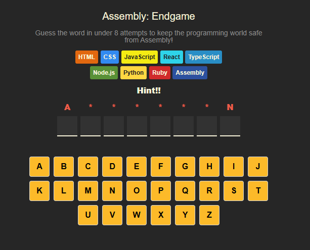
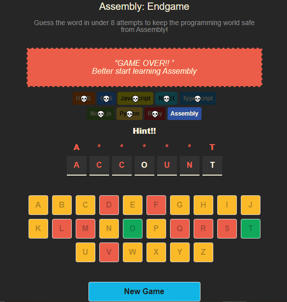
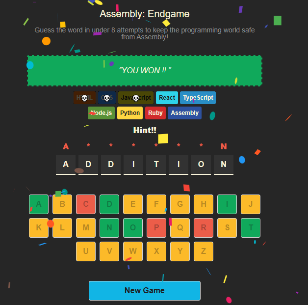

# 🧠 Assembly Endgame

A creative word guessing game where every incorrect guess "kills off" a programming language! Inspired by the spirit of Hangman — but with a developer twist.

---

## 🎮 Gameplay Overview

**Assembly Endgame** is a guessing game where:

- You must guess the correct letters of a hidden programming-related word.
- With each **wrong guess**, one of 8 programming languages is removed from the screen.
- After **8 wrong guesses**, it's **Game Over**.
- Guess the word before all languages are gone to **win**!

---

## 💡 Features

- ⚙️ Built using **ReactJS + Vite + HTML + CSS**
- 🎯 Logic powered by `useState` for tracking:
  - Correct and wrong guesses
  - Dynamic coloring (✅ green for right, ❌ red for wrong)
- 🔁 **Conditional rendering**:
  - "New Game" button appears after win/loss
  - 🎉 Confetti celebration only plays if the game is **won**
- 📜 Languages removed in this order with each wrong guess:


---

## 🖼️ Screenshots

### 🔤 Start of Game


### ❌ Game Over


### 🎉 Victory!


---

## 🛠️ Tech Stack

- **Frontend**: ReactJS, Vite, HTML, CSS
- **State Management**: React Hooks (`useState`)
- **Confetti**: `react-confetti` (or similar)
- **Deployment**: [Netlify](https://www.netlify.com/)

---

## 🚀 Getting Started

```bash
git clone https://github.com/your-username/assembly-endgame.git
cd assembly-endgame
npm install
npm run dev
